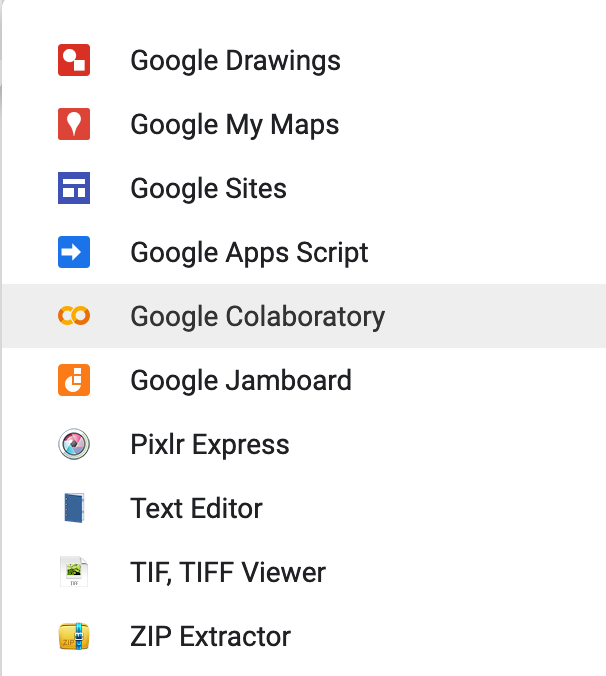
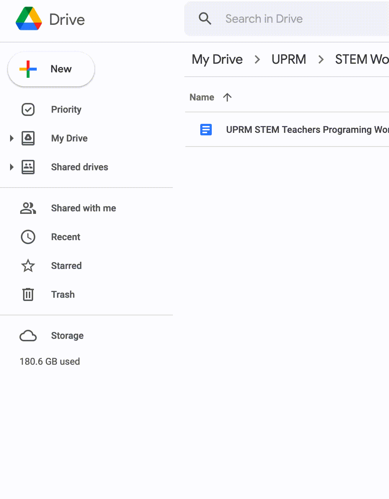

# Steps for this workshop
1. If you don't already have one, get a gmail account. We will be using Google's implementation of [Jupyter] Notebooks, also known as [Google Colab](https://colab.research.google.com/notebooks/intro.ipynb).
If you want to gather more information about what a notebook is then you might be interested in reading about what [Jupyter](https://en.wikipedia.org/wiki/Project_Jupyter) is.

 1. To begin with this workshop it is recommended that you look at the [First notebook](https://github.com/hsf-training/hsf-k12-python-for-stem-teachers/blob/master/notebooks/1-Introduction_to_Markdown_and_Python.ipynb) to learn about the implementations of Markdown, LaTeX and Python inside Google Colab's version of a Jupyter Notebook.

1. To open the notebook just click the  found on top of the file and you will instantly open the document online.

**Recommendation** MAKE A COPY BEFORE YOU START EDITING

Go to **File --> Save a copy in Drive**...

# Steps if you want to start from an empty notebook

- Fist thing we want to do is login to your google account and go to your Google Drive.
- From there we create a folder called "My Google Colab Notebooks" or any other name for the folder in which you will work.
- Then click on `More` then `Google Colab` button like in the images below:

<!--

 -->

And your done!

Now you are ready to become familiar with Python and introduce your students to the world of computing.

# If you want to run locally...

## Installing Jupyter Notebook

Two methods

1. You can install the [Anaconda distribution](https://www.anaconda.com/distribution/) for python which is filled with all the packages you will need. **Recommended Method**

2. Or you can manually install Jupyter Notebooks in your computer along with some basic packages as mentioned below. [Follow these instructions to install Jupyter](https://jupyter.org/install)

_You must have [python](https://www.python.org/downloads/) installed in your computer for Jupyter to work_

## Copying the files locally

If you have a command line with bash you can have a local copy of all the files that will be used in the workshop

Just do the following

_you can copy by either `ctrl-Shift-C` or simply by selecting the lines. You can paste in the command line by `ctrl-Shift-V` , `Shift-Ins` or `right-click`_

~~~
cd
git clone https://github.com/hsf-training/hsf-k12-python-for-stem-teachers.git
cd hsf-k12-python-for-stem-teachers/
~~~
{: .language-bash}

From here you can run all the notebooks used in this workshop.


