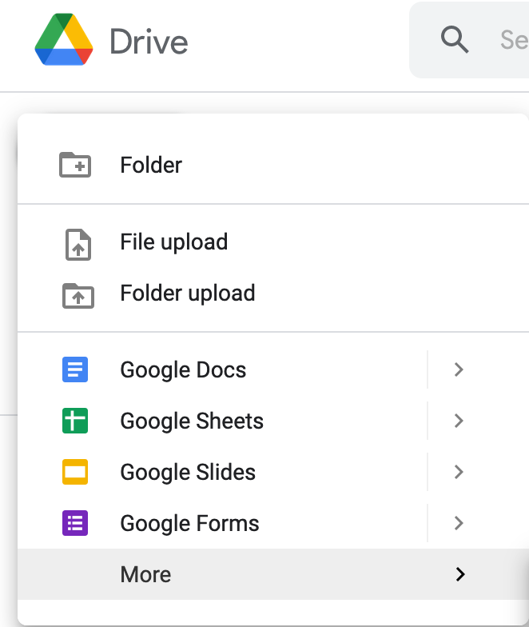

If you don't already have one, get a gmail account. We will be using Google's implementation of [Jupyter] Notebooks, also known as [Google Colab](https://colab.research.google.com/notebooks/intro.ipynb).

- Fist thing we want to do is login to your google account and go to your Google Drive.
- From there we create a folder called "My Google Colab Notebooks" or any other name for the folder in which you will work.
- Then click on `More` then `Google Colab` button like in the images below:

<!--

 -->

And your done!

Now you are ready to become familiar with Python and introduce your students to the world of computing.


